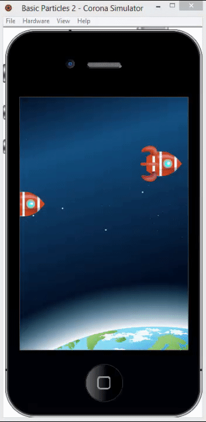

# Corona-Basic-Particles-2
Showcase application made in Corona SDK

This application shows basic particles effects that can be achieved with usage of Corona built-in support for particle effects.

Workflow to use the Corona built-in **display.newEmitter()** function starts with you designing your particle effects using an external GUI particle design tool (or emitter authoring tool).

For this application is used free online particle editor by OnebyOneDesign.com that can be found on this link http://onebyonedesign.com/flash/particleeditor/.
With this tool are made two particle effects that can be found in **emitters** folder (**rocket_exhaust.pex** and **rocket_ignite.pex** files).

To pre-process the .pex particle definition files in a format the can be consumed in Corona SDK the Ponywolf Pex4Corona library is used. This library can be found on this link https://github.com/ponywolf/ponypex.

Video below is showing what this showcase application is about

